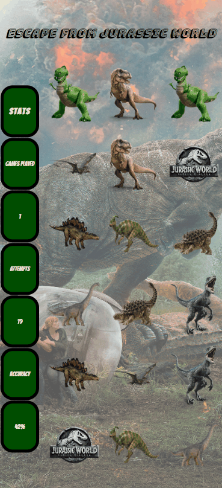

# memory-match
A dynamic, responsive web application for people who want to play Jurassic-park themed memory match.

## Live Website
Try the application live at [https://memory-match.jeff-j.me](https://memory-match.jeff-j.me)

## Technologies Used
- JavaScript
- HTML5
- CSS3

## Features
- User can play a game of memory match
- User can see number of games played
- User can see number of attempts during current round
- User can see accuracy (attempts / matches) during current round

## Preview


## Development

### System Requirements
- None

### Getting Started
1. Clone the repository.

    ```shell
    git clone https://github.com/jeff-jones2020/memory-match.git
    cd memory-match
    ```


2. You can view the project by opening index.html in your browser.
